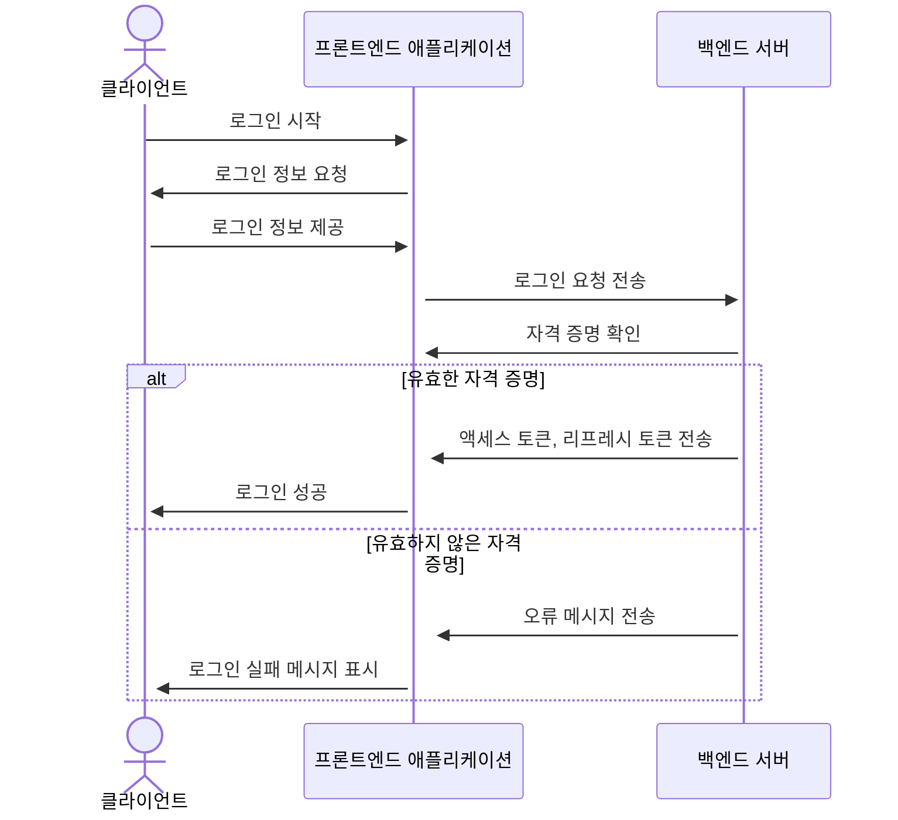
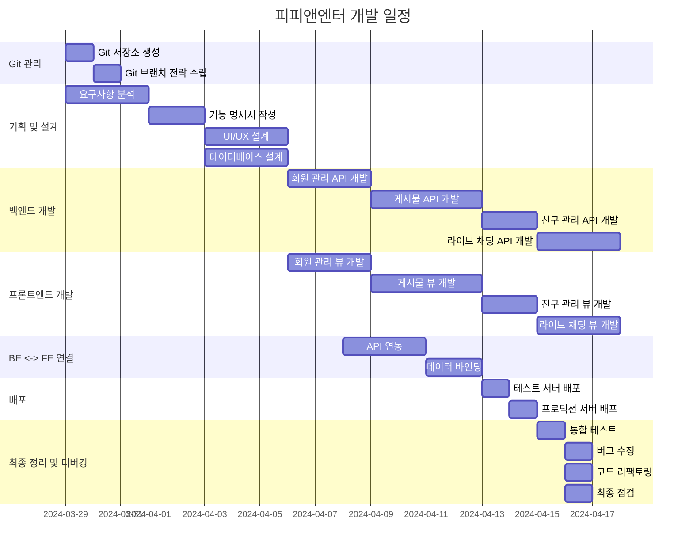
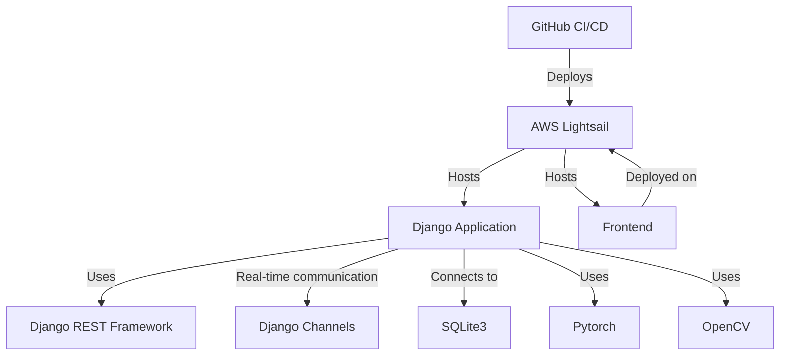
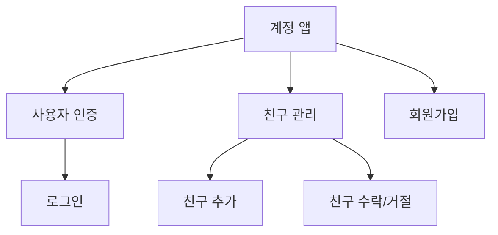
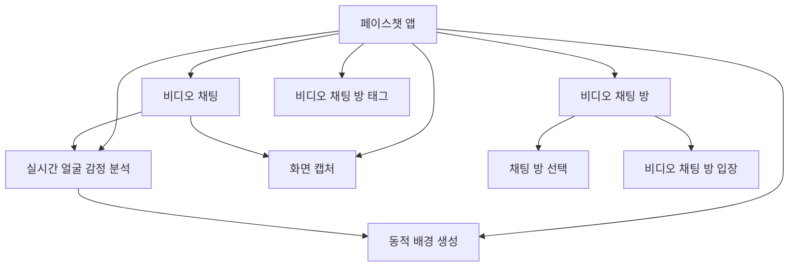
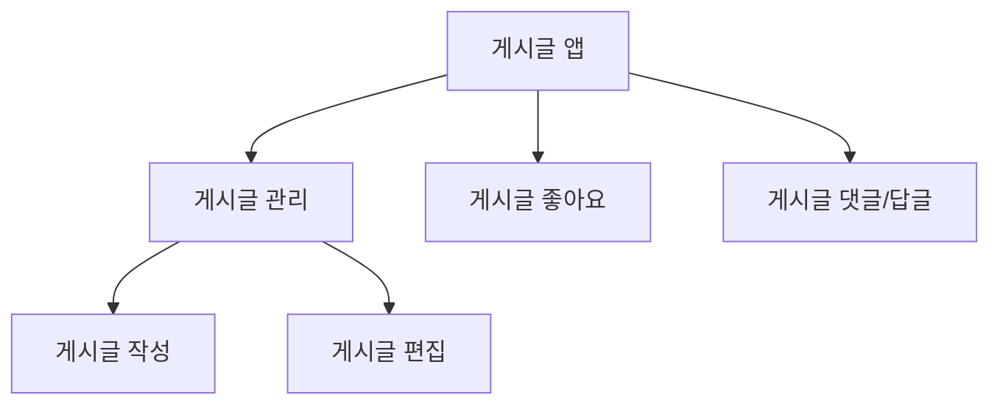

# PP-ENTER
## 영상통화 기능이 가능한 소셜 미디어 웹 서비스

## 1. 목표와 기능

### 1.1 목표
- 영상통화 기능으로 새로운 소셜 네트워크 서비스 제공
- 영상통화를 중심으로 한 화상회의, 실시간 소통과 일상 공유 플랫폼 구축
- 영상통화 중 감정 인식 기술을 활용해 참여자의 실시간 감정 표출 가능
- 영상통화 중 생성된 콘텐츠(스크린샷)를 바탕으로 한 커뮤니티 활성화

### 1.2 기능
- 실시간 영상통화 기능 (1:1 및 최대 2인 그룹 통화)
- 영상통화 중 참여자의 감정을 인식하고 분석하여 배경에 필터 적용
- 영상통화 스크린샷 캡처 및 저장
- 저장된 스크린샷을 피드에 포스팅하여 글쓰기 (공유 및 소통)
- 포스팅에 댓글, 좋아요 등 소셜 네트워크 기본 기능 지원
- 친구 추가, 팔로우 등 사용자 간 연결 기능


### 1.3 팀 구성
- 실제 사진을 업로드 하시길 권합니다.
<table>
	<tr>
		<th>팀원 : 박상현</th>
		<th>팀원 : 엄영철</th>
		<th>팀원 : 이은희</th>
		<th>팀장 : 진성현</th>
	</tr>
 	<tr>
		<td></td>
		<td></td>
		<td></td>
		<td></td>
	</tr>
</table>

## 2. 개발 환경 및 배포 URL
### 2.1 개발 환경
- Web Framework
    - Django 4.2.11 (Python 3.8.10)
- CSS Framework
    - Tailwind
- library
    - TensorFlow, OpenCV, PyTorch
- Deployment Environment
    - Amazon Lightsail
- Design
    - Figma
 
### 2.2 배포 URL

- 백엔드 배포 URL
- http://43.200.108.45/admin/

  ```
  id : admin 
  pw : test1234!
  ```

### 2.3 URL 구조(마이크로식)

**accounts** 

| Method | URL Pattern | View Name | Description | Authentication | Permission |
|--------|-------------|-----------|-------------|---------------|------------|
| POST | /register/ | RegisterView | 새로운 사용자 등록 | - | - |
| POST | /login/ | LoginView | 사용자 로그인 | - | - |
| POST | /refresh/ | TokenRefreshView | Access Token 갱신 | ✅  | ✅  |
| PUT | /update/ | UserUpdateView | 사용자 정보 업데이트 | ✅  | ✅|
| POST | /friend-request/ | FriendRequestView | 친구 요청 보내기 | ✅  | ✅|
| POST | /friend-requests/<int:friend_request_id>/accept/ | AcceptFriendRequestView | 친구 요청 수락 | ✅ | ✅|
| GET | /profile/<int:pk>/ | ProfileView | 사용자 프로필 조회 | - | - |
| GET | /friends/ | FriendView | 친구 목록 조회 | ✅  | ✅  |
| POST | /friends/ | FriendView | 친구 추가 | ✅  | ✅  |

**facechats**

| Method | URL Pattern | View Name | Description | Authentication | Permission |
|--------|-------------|-----------|-------------|---------------|------------|
| GET | / | facechat_list | 페이스챗 목록 조회 | - | - |
| GET | /<int:pk>/ | facechat_detail | 특정 페이스챗 상세 조회 | - | - |
| POST | /create_facechat/ | facechat_create | 새로운 페이스챗 생성 | ✅  | ✅  |
| PUT | /<int:pk>/ | facechat_update | 특정 페이스챗 수정 | ✅  | ✅  |
| DELETE | /<int:pk>/ | facechat_delete | 특정 페이스챗 삭제 | ✅  | ✅  |
| POST | /<int:pk>/join/ | facechat_join | 특정 페이스챗에 참여 | ✅  | - |
| POST | /<int:pk>/exit/ | facechat_exit | 특정 페이스챗에서 퇴장 | ✅  | - |

**posts** 

| Method | URL Pattern | View Name | Description | Authentication | Permission |
|--------|-------------|-----------|-------------|---------------|------------|
| GET | /posts/ | PostListView | 최근 10개의 포스트 목록을 가져옵니다. | - | - |
| POST | /create/ | PostCreateView | 새로운 포스트를 생성합니다. | ✅  | - |
| GET, PUT, DELETE | /posts/<int:pk>/ | PostRetrieveUpdateDestroyView | 특정 포스트의 상세 정보를 조회, 수정, 삭제합니다. | ✅  (PUT, DELETE) | Owner (PUT, DELETE) |
| POST | /likes/ | LikeCreateView | 좋아요를 생성합니다. | ✅ | - |
| DELETE | /likes/<int:pk>/ | LikeDestroyView | 특정 좋아요를 삭제합니다. | ✅  | ✅  |
| POST | /favorites/ | FavoriteCreateView | 즐겨찾기를 생성합니다. | ✅ | - |
| DELETE | /favorites/<int:pk>/ | FavoriteDestroyView | 특정 즐겨찾기를 삭제합니다. | ✅  | ✅  |
| POST | /comments/ | CommentCreateView | 댓글을 생성합니다. | ✅  | - |
| PUT, DELETE | /comments/<int:pk>/ | CommentUpdateDestroyView | 특정 댓글을 수정, 삭제합니다. | ✅ | ✅ |
| GET, POST | /tags/ | TagListCreateView | 태그 목록을 가져오고 새로운 태그를 생성합니다. | ✅ | - |
| GET | /tags/search/ | TagSearchView | 태그를 검색합니다. | - | - |
| DELETE | /tags/<int:pk>/ | TagDestroyView | 특정 태그를 삭제합니다. | ✅ | ✅ |
| POST | /photo_tags/ | PhotoTagCreateView | 포토 태그를 생성합니다. | ✅ | ✅  |
| DELETE | /photo_tags/<int:pk>/ | PhotoTagDestroyView | 특정 포토 태그를 삭제합니다. | ✅ | ✅ |
| GET | /posts_main_list/ | PostMainListView | 메인 페이지에서 최근 10개의 포스트 목록을 가져옵니다. | - | - |
| GET | /posts_detail_list/<int:userid>/ | PostDetailListView | 특정 사용자의 포스트 목록을 가져옵니다. | - | - |
| GET | /posts_main_list_search/<str:photo_name>/ | PostMainListSearchView | 메인 페이지에서 포토 이름으로 포스트를 검색합니다. | - | - |
| GET | /posts_detail_list_search/<str:photo_name>/ | PostDetailListSearchView | 상세 페이지에서 포토 이름으로 포스트를 검색합니다. | - | - |
| GET | /check-login/ | CheckLoginView | 사용자의 로그인 상태를 확인합니다. | ✅  | - |

## 3. 요구사항 명세와 기능 명세



## 4. 프로젝트 구조와 개발 일정
### 4.1 프로젝트 구조

    - 1. 📦PP-ENTER-BE

        ```
         ┣ 📂accounts
         ┃ ┣ 📂migrations
         ┃ ┃ ┗ 📜__init__.py
         ┃ ┣ 📜admin.py
         ┃ ┣ 📜apps.py
         ┃ ┣ 📜models.py
         ┃ ┣ 📜permissions.py
         ┃ ┣ 📜serializers.py
         ┃ ┣ 📜tests.py
         ┃ ┣ 📜urls.py
         ┃ ┣ 📜views.py
         ┃ ┗ 📜__init__.py
         ┣ 📂config
         ┃ ┣ 📜asgi.py
         ┃ ┣ 📜settings.py
         ┃ ┣ 📜urls.py
         ┃ ┣ 📜wsgi.py
         ┃ ┗ 📜__init__.py
         ┣ 📂facechats
         ┃ ┣ 📂migrations
         ┃ ┃ ┗ 📜__init__.py
         ┃ ┣ 📜admin.py
         ┃ ┣ 📜apps.py
         ┃ ┣ 📜consumers.py
         ┃ ┣ 📜models.py
         ┃ ┣ 📜routing.py
         ┃ ┣ 📜tests.py
         ┃ ┣ 📜urls.py
         ┃ ┣ 📜views.py
         ┃ ┗ 📜__init__.py
         ┣ 📂media
         ┃ ┗ 📜default.png
         ┣ 📂nginx
         ┃ ┣ 📜Dockerfile
         ┃ ┗ 📜nginx.conf
         ┣ 📂posts
         ┃ ┣ 📂migrations
         ┃ ┃ ┗ 📜__init__.py
         ┃ ┣ 📜admin.py
         ┃ ┣ 📜apps.py
         ┃ ┣ 📜models.py
         ┃ ┣ 📜serializers.py
         ┃ ┣ 📜tests.py
         ┃ ┣ 📜urls.py
         ┃ ┣ 📜views.py
         ┃ ┗ 📜__init__.py
         ┣ 📜.env.dev
         ┣ 📜.gitattributes
         ┣ 📜.gitignore
         ┣ 📜docker-compose.dev.yml
         ┣ 📜docker-compose.yml
         ┣ 📜Dockerfile
         ┣ 📜manage.py
         ┣ 📜README.md
         ┣ 📜requirements.txt
         ┣ 📜게시글쓰기_와이어프레임.png
         ┣ 📜로그인_와이어프레임.png
         ┣ 📜메인페이지_와이어프레임.png
         ┣ 📜방만들기_와이어프레임.png
         ┣ 📜프로필_와이어프레임.png
         ┣ 📜화상통화_와이어프레임.png
         ┗ 📜회원가입_와이어프레임.png
        ```

    - 2. 📦PP-ENTER-FE
        
        ```
         ┣ 📂accounts
         ┃ ┣ 📜login.html
         ┃ ┣ 📜profile.html
         ┃ ┗ 📜register.html
         ┣ 📂facechats
         ┃ ┣ 📜facechat.html
         ┃ ┣ 📜facechat_2.html
         ┃ ┗ 📜facechat_원본.html
         ┣ 📂media
         ┃ ┗ 📂img
         ┃ ┃ ┣ 📜img_logo.png
         ┃ ┃ ┣ 📜img_person_1.png
         ┃ ┃ ┣ 📜img_person_2.png
         ┃ ┃ ┣ 📜img_person_3.png
         ┃ ┃ ┗ 📜img_person_4.png
         ┣ 📂posts
         ┃ ┣ 📜post_create.html
         ┃ ┣ 📜post_detail.html
         ┃ ┣ 📜post_list.html
         ┃ ┗ 📜post_update.html
         ┣ 📂posts_uni
         ┣ 📂static
         ┃ ┣ 📂assets
         ┃ ┃ ┗ 📂img
         ┃ ┃ ┃ ┣ 📜img_logo.png
         ┃ ┃ ┃ ┣ 📜img_profile.jpg
         ┃ ┃ ┃ ┣ 📜img_slider1.png
         ┃ ┃ ┃ ┣ 📜img_slider2.png
         ┃ ┃ ┃ ┣ 📜img_slider3.png
         ┃ ┃ ┃ ┗ 📜profile.png
         ┃ ┣ 📂css
         ┃ ┃ ┣ 📜style.css
         ┃ ┃ ┗ 📜tailwind_custom.css
         ┃ ┗ 📂js
         ┃ ┃ ┣ 📜app.js
         ┃ ┃ ┣ 📜call.js
         ┃ ┃ ┣ 📜create_card.js
         ┃ ┃ ┣ 📜create_post_template.js
         ┃ ┃ ┣ 📜create_room.js
         ┃ ┃ ┣ 📜link.js
         ┃ ┃ ┣ 📜login.js
         ┃ ┃ ┣ 📜post_create.js
         ┃ ┃ ┣ 📜post_update.js
         ┃ ┃ ┣ 📜signup.JS
         ┃ ┃ ┗ 📜slider-img.js
         ┗ 📜README.md
        ```

### 4.1 개발 일정(WBS)
* 아래 일정표는 머메이드로 작성했습니다.


## 5. 와이어프레임 / UI / BM

### 5.1 와이어프레임
<table>
        <tr>
            <td>회원가입</td>
            <td>로그인</td>
        </tr>
        <tr>
            <td>
                
            </td>
            <td>
                
            </td>
        </tr>
        <tr>
            <td>메인</td>
            <td>프로필</td>
        </tr>
        <tr>
            <td>
                
            </td>
            <td>
                
            </td>
        </tr>
        <tr>
            <td>게시글 작성</td>
            <td>방 만들기</td>
        </tr>
        <tr>
            <td>
                
            </td>
            <td>
                
            </td>
        </tr>
        <tr>
            <td>화상통화</td>
        </tr>
        <tr>
            <td>
                
            </td>
        </tr>
</table>

### 5.2 화면 설계
- 화면은 gif파일로 업로드해주세요.
 
<table>
    <tbody>
        <tr>
            <td>회원가입</td>
            <td>로그인</td>
        </tr>
        <tr>
            <td>
        
            </td>
            <td>
                
            </td>
        </tr>
        <tr>
            <td>메인페이지</td>
            <td>메인페이지 더보기</td>
            <td>세부내역클릭</td>
        </tr>
        <tr>
            <td>
                
            </td>
            <td>
                
            </td>
            <td>
                
            </td>
        </tr>
        <tr>
            <td>페이스챗 방 만들기(발신자)</td>
            <td>전화받기(수신자)</td>
            <td>채팅하기</td>
        </tr>
        <tr>
            <td>
            
            </td>
            <td>
                
            </td>
            <td>
                
            </td>
        </tr>
        <tr>
            <td>게시글 작성</td>
            <td>검색</td>
            <td>게시글 삭제</td>
        </tr>
        <tr>
            <td>
                
            </td>
            <td>
                
            </td>
            <td>
                
            </td>
        </tr>
    </tbody>
</table>


## 6. 데이터베이스 모델링(ERD)


## 7. Architecture



## 8. 메인 기능
- Account App은 시스템 내에서 사용자 인증, 친구 관리, 사용자 등록을 처리합니다. 

    사용자 인증: 사용자가 자격 증명을 사용하여 계정에 안전하게 로그인할 수 있습니다.
    친구 관리: 사용자가 친구 요청 추가, 수락/거부 등 친구 목록을 관리할 수 있습니다.
    사용자 등록: 신규 사용자가 시스템에 가입하고 계정을 생성할 수 있는 사용자 친화적인 인터페이스를 제공합니다.

- FaceChat 앱은 영상 채팅 기능과 상호 작용을 관리하는 역할을 합니다. 

    영상 채팅방 관리: 사용자가 실시간 영상 통화에 참여할 수 있는 영상 채팅방을 만들고 참여할 수 있습니다.
    실시간 얼굴 감정 분석: 영상 통화 중 사용자의 표정을 분석하여 감정에 대한 통찰력을 제공합니다.
    동적 배경 생성: 사용자의 얼굴 표정을 기반으로 배경을 동적으로 생성하여 영상 채팅 경험을 향상시킵니다.
    채팅룸 스크린샷 캡처: 사용자가 영상 통화 중에 스크린샷을 캡처하여 기억에 남는 순간을 보존할 수 있습니다.

- Post 앱은 게시물 및 상호 작용을 포함하여 사용자 생성 콘텐츠를 관리하는 데 중점을 둡니다. 
    게시물 관리: 사용자에게 플랫폼 내에서 게시물을 생성, 편집, 삭제할 수 있는 기능을 제공합니다.
    게시물 상호작용: 사용자가 게시물에 좋아요를 누르고 댓글이나 답글을 남겨 게시물과 상호작용할 수 있습니다.
    게시물 태그 지정: 사용자가 게시물을 분류하고 다른 사용자가 쉽게 검색할 수 있도록 태그를 지정할 수 있습니다.







## 9. 에러와 에러 해결
- Facechat 관련에러
    1. 연결 문제
        
        상황  : Django Channels에서 웹소켓 연결 시 사용자 인증 실패 및 사용자가 화상채팅을 시도할 때 연결이 지연되거나 전혀 이루어지지 않음.
        
        원인 : 클라이언트와 서버 간 웹소켓 설정 및 WebRTC 설정 불일치,  Channels 인증 미들웨어에서 토큰을 올바르게 처리하지 못함. routing 설정 시 URL 패턴과 일치하지 않음
        
        해결방안(트러블 슈팅) 
        
        1. 서버 로그를 검토하여 오류 메시지 확인.
        2. 서버 주소와 포트가 올바르게 설정되었는지 확인
        3. WebRTC 연결 확인 및 URL 패턴을 검토
        
        ```jsx
        function connectSocket() {
            let ws_scheme = window.location.protocol == "https:" ? "wss://" : "ws://";
            callSocket = new WebSocket(
                ws_scheme
                + window.location.host // localhost 혹은 서버 주소
                + '/ws/call/'
            );
        ```
        
        ```python
        from django.urls import re_path
        from . import consumers
        
        websocket_urlpatterns = [
             re_path(r'ws/call/', consumers.CallConsumer.as_asgi()),
        ]
        ```
        
    2. 보안 문제
        
        상황  : 외부로 노출 시 영상 처리에 대한 보안 문제 발생, HTTPS 페이지에서 ws:// 연결 차단
        
        원인 : 데이터가 암호가 적용되지 않고 있음, 혼합 콘텐츠 정책으로 HTTP페이지에서는 wss://를 사
        
        해결방안(트러블 슈팅) 
        
        1. 배포 시 모든 웹소켓 연결에 WSS(WebSocket Secure) 사용
        
        ```jsx
        window.location.protocol == "https:" ? "wss://" : "ws://";
        // localhost의 경우 ws를 https:의 경우 wss:를 사용할 수 있도록 설정
        ```
        
    3. 메시지 전송
        
        상황  : 메시지 전송 기능 구현 시 Redis 오류 발생('BZPOPMIN' 에러 출력)
        
        원인 : 윈도우 환경에서 Redis 5.0 이상 버전만 지원(설치 파일 필요)
        
        해결방안(트러블 슈팅) 
        
        1. 리눅스 환경에서 Redis 설치 방안 확인(업데이트 명령어 존재)
        2. 배포를 통해 메시지 기능 구현.

    4. Channels 모듈 사용 이슈
        
        상황: 최신 버전 모듈에서 ASGI 서버 사용에 대한 이슈 발생
        
        해결: 적절한 Channels 모듈의 버전 확인 후 적용
        
        ```python
        pip install channels==3.0.5 
        ```
- 배포 관련 에러

    1. 상황
        - /etc/nginx/sites-enabled/default 파일에서 server_name과 root 지시어를 사용하고, location / 블록이 없어서 nginx가 작동하지 않았습니다.

        해결방안(트러블 슈팅)
        - 1. server_name 지시어 제거: 모든 도메인에 대해 해당 서버 블록이 응답하도록 설정했습니다.
        - 2. root 지시어 제거: location / 블록에서 proxy_pass를 사용하여 요청을 다른 서버로 전달하고 있으므로, root 지시어는 필요하지 않습니다.
        - 3. location / 블록 추가: 모든 요청을 처리하도록 설정하고, proxy_pass 지시어를 사용하여 요청을 Unix 소켓(/tmp/gunicorn.sock)을 통해 Gunicorn 서버로 전달했습니다.
        - 4. 위와 같이 nginx 설정 파일을 수정함으로써, 모든 요청을 Gunicorn 서버로 전달하고 nginx는 프록시 역할을 수행하도록 설정되었기 때문에 nginx가 올바르게 작동하게 되었습니다.

    2. 상황
        - GitHub Actions의 yml 파일에서 `python manage.py migrate` 명령어가 제대로 작동하지 않음
        - Django 마이그레이션 실행 시 오류 발생
    
        해결방안(트러블 슈팅)
        
        - `python manage.py migrate` 대신 `python3 manage.py migrate --run-syncdb` 명령어를 사용
        - `python3`을 명시적으로 사용하여 Python 3 버전에서 실행되도록 함
        - `-run-syncdb` 옵션을 추가하여 데이터베이스 스키마와 마이그레이션 파일을 동기화하도록 설정
        - 위의 변경 사항을 적용한 후 GitHub Actions의 yml 파일이 정상적으로 작동하고 Django 마이그레이션이 성공적으로 실행됨

        
## 10. 프로젝트를 마치며

- 진성현
    - 각자 다른 기술 역량을 가진 팀원들과 프로젝트를 진행해보면서 저희 팀이 보여주고 또 하고 싶은 것들이 많았던 것 같습니다. 기획에 따라 개발을 해보면서 잘 모르는 부분들을 만나고 여러 에러들이 발생하면서 우리가 주어진 기간에 완전한 완성을 하는 것은 무리가 있던 기획이었구나를 알게 되었습니다. 하지만 이번 프로젝트 과정에서 기획과 그것을 개발로 직접 바꾸어 보는 경험을 하면서 탄탄한 기획과 개발이라는 것은 프로젝트가 진행되는 순간 순간에 팀원들과 많은 소통이 필요하고 상황마다 유동적으로 대처를 해가면서 함께 만들어 가는 것임을 제대로 느낄 수 있는 좋은 시간이었습니다. 팀장으로써 함께 아이디어부터 구현까지 진행해보았던 이번 프로젝트 경험을 통해서 협업을 하는 방법과 팀 프로젝트를 진행하는 방법을 이해한 것 같습니다.

- 박상현
    - 저는 이번 프로젝트에서 DRF WebRTC에 감정 분석 모델을 통합하는 작업을 맡았지만, 라이브러리 내부 코드를 수정하는 과정에서 실패하게 되었습니다. 복잡한 라이브러리 구조와 개발자의 의도를 파악하는 데 시간이 오래 걸렸고, 지속적으로 발생하는 에러는 해결하는데 큰 어려움을 겪었습니다. 이번 경험을 통해 라이브러리 활용 시에는 내부 코드 수정을 최소화하고 제공되는 인터페이스를 적극 활용해야 한다는 교훈을 얻었습니다. 비록 완벽한 성공은 아니었지만, 이번 도전은 라이브러리 활용과 수정의 trade-off를 직접 체험하게 해준 의미 있는 경험이었습니다.

- 이은희 
    - 이번 프로젝트를 통해 실무 개발 환경에서의 협업 방식과 전체 서비스 개발 프로세스를 깊이 있게 경험할 수 있었습니다. 역량이 다른 팀원들과 함께 하나의 서비스를 만들어나가며, 개인 프로젝트로는 체험하기 어려운 다양한 상황을 접할 수 있었습니다. 특히 아이디어 기획이나 디자인 역량을 가진 팀원은 없었지만, 피그마에 모여 모두가 의견을 내고 취합하는 과정을 거치며 프론트엔드와 백엔드 기술자 간 지식과 관점의 차이를 실감나게 경험할 수 있었습니다. 서로 다른 시각에서 같은 개념을 바라보는 모습을 확인하며, 원활한 의사소통의 중요성을 깨달을 수 있었습니다.
    처음 접해보는 도구와 기술에 도전할 수 있었고, 팀원 중 경험이 있는 분들의 조언으로 이해하는 데 어려움이 없었습니다. 특정 기능 구현에 매몰되어 있을 때도 팀원들의 피드백을 통해 객관성을 유지할 수 있었으며, 전체 서비스 개선을 위한 통찰력을 기를 수 있었습니다. 이번 프로젝트는 실무 환경에서의 협업 방식과 개발 프로세스를 배울 수 있었던 큰 성장의 기회였습니다.

- 엄영철
    - 처음 사용하는 기술과 협업 페이지를 사용하여 프로젝트를 진행하면서 어려운 점이 있었지만 각 팀원들의 의견을 듣고 소통하고 하나의 목표를 설정하여 같이 성장하면서 좋은 개발자가 되기 위한 경험을 한 것 같습니다. 부족한 부분을 채워주고, 각각의 역할을 나눠 효율적으로 진행하기 위해 결정한 것들은 개인적인 프로젝트였다면 느끼지 못할 경험이었던 것 같습니다. 오랜만에 다시 하는 팀 프로젝트로, 기획 대비 결과가 부족하지만 그런 상황 속에서 어떻게든 구현하려고 서로 응원하고 책임감을 가지고 작업했던 것들은 서로에게 배울점이었다고 생각합니다. 어떻게든 구현만 되면 된다고 생각하고 있던 것들을 반성했고 탄탄한 기획과 의사소통, 코드리뷰 등 많은 것들을 배울 수 있었습니다. 
